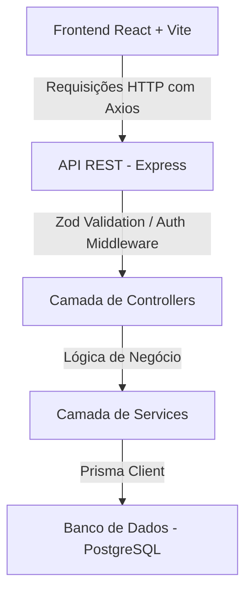
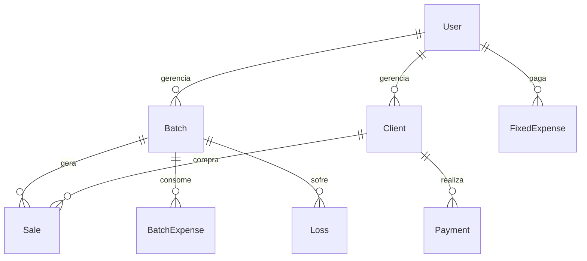

# 📐 Aviarios Pro - Documentação Científica e Guia de Reconstrução do Zero

Este documento serve como um **blueprint técnico e conceitual completo** do sistema **Aviarios Pro**. Ele foi elaborado para explicar detalhadamente cada engrenagem do projeto — desde a modelagem física do banco de dados até a mecânica de animações e otimização de queries — de forma que qualquer desenvolvedor possa compreender a fundo o ecossistema ou reconstruí-lo do absoluto zero.

---

## 🛠️ 1. Arquitetura de Alto Nível
O Aviarios Pro é construído como uma aplicação de arquitetura desacoplada (Decoupled SPA/API):



### Divisão de Responsabilidades
1. **Frontend (SPA)**: Responsável exclusivamente pela renderização da interface, gestão de estado local, caching de consultas com TanStack Query e animações com Framer Motion.
2. **Backend (API)**: Responsável pela validação de dados, controle de sessão, segurança, transações bancárias e execução da lógica matemática de CMV (Custo de Mercadoria Vendida) e lucratividade.

---

## 💾 2. Modelagem do Banco de Dados (Prisma Schema)

O banco de dados PostgreSQL é modelado de forma relacional estrita para garantir a integridade referencial física. Abaixo está a explicação de cada entidade:



### Entidades Detalhadas
1. **User (Usuário)**: Guarda as credenciais (`email`, `password` com hash bcrypt) e serve como chave de isolamento de dados global (`userId`).
2. **Batch (Lote)**: O núcleo de produção. Contém:
   - `initialQuantity`: Aves compradas inicialmente.
   - `actualQuantity`: Aves vivas remanescentes (ajustadas dinamicamente).
   - `buyPrice`: Preço pago por ave no atacado.
   - `transportCost`: Custo fixo do frete para trazer este lote.
   - `status`: `ACTIVE` (ativo) ou `CLOSED` (fechado/esgotado).
3. **Client (Cliente)**: Registra o comprador (`name`, `phone`, `email`).
4. **Sale (Venda)**: Registra saídas de aves do lote. Pode ser à vista ou a prazo (fiado):
   - `quantity`: Quantidade de aves vendidas.
   - `unitPrice`: Valor cobrado por ave.
   - `totalPrice`: Quantidade × unitPrice.
   - `status`: `PAID` (pago) ou `PENDING` (fiado/pendente).
5. **FixedExpense (Despesa Operacional)**: Custos globais mensais do negócio (e.g., Conta de Luz, Água, Salário dos funcionários). Não pertencem a um lote específico.
6. **BatchExpense (Insumo)**: Gastos diretos atrelados a um lote (e.g., Sacos de ração, vacinas, remédios). Essencial para calcular o custo do lote.
7. **Loss (Baixa/Morte)**: Controle de mortalidade das aves. Registra quantidade e motivo.
8. **Payment (Pagamento)**: Lançamentos feitos por clientes para amortizar suas dívidas de compras com status `PENDING`.

---

## 📈 3. As Fórmulas Matemáticas do Negócio (Finanças & CMV)

Para entregar lucros reais e transparentes, o sistema implementa cálculos contábeis rígidos de **CMV (Custo de Mercadoria Vendida)**.

### A. Cálculo do Custo Real de um Lote
O custo de um lote não é apenas o preço de compra das aves. A fórmula exata do **Custo Total do Lote ($C_{total}$)** é:

$$C_{total} = (Q_{inicial} \times P_{compra}) + C_{transporte} + C_{insumos} + C_{operacionais\_prorrateados}$$

Onde:
- **$C_{insumos}$**: Soma de todos os lançamentos em `BatchExpense` para aquele lote (rações, vacinas).
- **$C_{operacionais\_prorrateados}$**: Rateio diário das despesas fixas da empresa no período em que o lote ficou ativo.
  - *Rateio Diário* = $\frac{\text{Soma de todas as FixedExpense do mês}}{30 \text{ dias}}$
  - *Custo Prorrateado* = $\text{Rateio Diário} \times \text{Dias ativos do lote}$

### B. Lucro Real Mensal
$$Lucro = \text{Faturamento das Vendas} - \text{CMV}$$

Esse cálculo previne a falsa sensação de lucro de muitos produtores, pois desconta perdas por mortes (aves dadas de baixa deixam de gerar faturamento, mas o custo de sua compra e alimentação continua somado no CMV total do lote).

---

## ⚙️ 4. Otimizações de Engenharia & Integridade de Dados

### 🛡️ A. Integridade Atômica com Transações ACID ($transaction)
Em sistemas de vendas e controle de estoque, a maior ameaça é a **inconsistência de concorrência** (e.g., duas pessoas venderem a mesma ave ao mesmo tempo, gerando estoque negativo, ou registrar a morte de uma ave e o sistema não atualizar a quantidade total do lote).

No **Aviarios Pro**, resolvemos isso blindando os serviços com **Transações de Banco de Dados** usando o recurso `$transaction` do Prisma:

```typescript
await prisma.$transaction(async (tx) => {
  // 1. Busca o lote com exclusividade (lock)
  const batch = await tx.batch.findUnique({ where: { id: batchId } });
  
  // 2. Valida o estoque atual
  if (batch.actualQuantity < soldQuantity) {
    throw new Error('Estoque insuficiente');
  }

  // 3. Atualiza a quantidade do lote
  await tx.batch.update({
    where: { id: batchId },
    data: { actualQuantity: batch.actualQuantity - soldQuantity }
  });

  // 4. Cria o registro de venda
  await tx.sale.create({ data: { ... } });
});
```
Se qualquer um dos passos falhar (por exemplo, falta de internet no meio do processo ou um erro na criação do registro da venda), o banco de dados sofre um **Rollback** instantâneo e cancela todas as ações anteriores, mantendo o estoque de aves 100% íntegro.

---

### 🔄 B. Fechamento Automático de Lote por Esgotamento
Um lote representa um grupo físico e temporal de aves. Quando a quantidade de aves vivas do lote (`actualQuantity`) cai exatamente para **zero** (seja devido a vendas completas ou baixas por morte), o sistema executa automaticamente a transição de estado do lote:

$$\text{Se } actualQuantity = 0 \implies status = \text{'CLOSED'}$$

Essa regra de negócio é disparada de forma invisível dentro de `saleService.ts` e `lossService.ts`. O fechamento impede que novos lançamentos de vendas, mortes ou insumos sejam feitos em um lote que fisicamente não existe mais, além de congelar a data de encerramento do lote para o cálculo final de rentabilidade e CMV histórico.

---

### 🚛 C. Prorrateamento Inteligente do Custo de Transporte (Frete)
O frete para trazer as aves é um custo fixo único por lote. Se o produtor simplesmente lança o frete como despesa geral, o lucro unitário por ave é distorcido.

O sistema resolve isso aplicando uma **fórmula de custo unitário amortizado**:
- O frete (`transportCost`) é cadastrado diretamente no lote (`Batch`).
- No cálculo do custo real de produção, o custo de transporte é dividido pela quantidade inicial de aves:

$$\text{Custo de Transporte Unitário} = \frac{C_{transporte}}{Q_{inicial}}$$

Este valor é somado ao preço de compra original da ave, integrando-se diretamente ao CMV do lote. Assim, o produtor sabe exatamente quanto cada ave custou para ser comprada e transportada até o aviário.

---

### 🔑 D. Fluxo de Sessão Stateless e Interceptadores Axios
O frontend gerencia a sessão do usuário de forma moderna e sem estado (stateless) usando **JWT (JSON Web Tokens)**:
1. **Login**: O usuário se autentica, e o backend emite um token assinado. O frontend armazena este token no `localStorage`.
2. **Interceptador de Requisição (`frontend/src/lib/api.ts`)**: Para evitar ter que incluir manualmente o cabeçalho de autenticação em cada requisição de vendas ou lotes, configuramos um interceptor Axios que escuta todas as requisições enviadas ao servidor:
   ```typescript
   api.interceptors.request.use((config) => {
     const token = localStorage.getItem('@AviarioPro:token');
     if (token) {
       config.headers.Authorization = `Bearer ${token}`;
     }
     return config;
   });
   ```
3. **Segurança Descentralizada**: O backend recebe o token, descriptografa-o no middleware de autenticação, extrai o `userId` e o injeta no ciclo de vida da requisição Express. O banco é consultado sempre sob esse ID.

---

## ⚙️ 5. Otimização de Engenharia: O Fim do Gargalo N+1

### O Problema
Na tela de clientes, o sistema precisa exibir o **Saldo Devedor** de cada pessoa. 
Se fôssemos fazer isso de forma ingênua:
1. Buscaríamos os 100 clientes cadastrados (`GET /clients`) -> **1 query**.
2. Para cada um dos 100 clientes, faríamos uma consulta no banco para somar as vendas pendentes e subtrair os pagamentos -> **100 queries**.
Isso resulta em **101 idas ao banco de dados (Gargalo N+1)**, travando a API e derrubando a performance.

### A Solução Otimizada
No arquivo `clientService.ts`, resolvemos isso com uma **única query agregada** usando joins relacionais do Prisma:

```typescript
const clients = await prisma.client.findMany({
  where: { userId },
  include: {
    sales: {
      where: { status: 'PENDING' },
      select: { totalPrice: true }
    },
    payments: {
      select: { amount: true }
    }
  }
});
```

Depois, o backend calcula os saldos em memória:
- **Total em Dívidas** = $\sum \text{vendas pendentes}$
- **Total Pago** = $\sum \text{pagamentos}$
- **Saldo Devedor Real** = $\text{Total em Dívidas} - \text{Total Pago}$

Toda essa operação acontece em **uma única query ao banco de dados**, reduzindo o uso de CPU e largura de banda drasticamente!

---

## 🎨 5. A Engenharia das Animações Premium (Framer Motion)

Para tornar a experiência visual espetacular e viva, aplicamos uma física realista nos números financeiros (`MetricCard.tsx`).

### O Efeito "Rolagem de Caixa Registradora"
Toda vez que o usuário muda o mês de visualização, os números dos cards financeiros sobem ou descem de acordo com a flutuação do dinheiro.

1. **Comparador de Estado Intermediário**:
   Guardamos o valor anterior do card usando um `useRef` para não disparar renderizações extras:
   ```typescript
   const prevValueRef = useRef(value);
   ```

2. **Detecção de Direção**:
   Limpamos strings como `"MZN 12.500"` convertendo-as em números puros e comparamos:
   - Se o valor **subiu** -> define `direction = 'up'`
   - Se o valor **desceu** -> define `direction = 'down'`

3. **Mapeamento de Coordenadas no Framer Motion**:
   - **Se subiu (`up`)**: O número antigo sai por cima (`y: -24`) e o novo entra por baixo (`y: 24`).
   - **Se desceu (`down`)**: O número antigo sai por baixo (`y: 24`) e o novo entra por cima (`y: -24`).

O uso de `AnimatePresence mode="popLayout"` tira o elemento que está saindo do fluxo de renderização física instantaneamente, impedindo que o card "estique" ou dê solavancos durante a transição.

---

## 📱 6. Blindagem de Layout contra CSS Date Overflow

### O Problema
Nos celulares, navegadores como Safari (iOS) e Chrome aplicam layouts nativos intrusivos para o `<input type="date">`. Eles injetam ícones de calendário e controles de toque que forçam uma largura mínima interna. Se o input tiver bordas e paddings normais, ele ignora o `width: 100%` e estoura as laterais da tela do celular.

### A Solução
Criamos um padrão de empacotamento com **div de contenção**:

```html
<!-- A DIV controla a estética (bordas, arredondamento, foco e limite físico) -->
<div class="w-full min-w-0 overflow-hidden bg-background border border-border rounded-lg focus-within:border-yellow-500/50">
  <!-- O INPUT de data fica transparente e sem bordas, herdando a contenção -->
  <input 
    type="date" 
    class="w-full bg-transparent h-11 px-3 outline-none text-sm text-foreground block min-w-0" 
  />
</div>
```

Com o `overflow-hidden` e `min-w-0` na `div`, qualquer tentativa do input nativo de crescer lateralmente no celular é cortada de forma limpa pelo contêiner, garantindo um layout sempre intacto.

---

## 🛠️ 7. Guia Passo a Passo: Reconstruindo do Absoluto Zero

Se você perder todo o código do projeto e precisar reerguê-lo a partir do zero, siga rigorosamente estes 5 passos:

### **Passo 1: Banco de Dados & Modelagem**
1. Crie uma pasta `backend`, rode `npm init -y` e instale as dependências: `npm i express cors dotenv jsonwebtoken bcrypt zod @prisma/client` e as de desenvolvimento: `npm i -D typescript @types/node @types/express prisma tsx`.
2. Inicialize o Prisma: `npx prisma init`.
3. Escreva o arquivo `schema.prisma` com as tabelas descritas na Seção 2, definindo as relações (e.g. `Client.sales` e `Sale.client`).
4. Execute as migrations: `npx prisma migrate dev --name init`.

### **Passo 2: Core do Servidor & Segurança**
1. Crie o arquivo `backend/src/middlewares/auth.ts` para ler o cabeçalho `Authorization: Bearer <token>`, decodificar o JWT e anexar o `userId` à requisição Express (`req.userId`).
2. Crie uma central de tratamento de erros (`backend/src/middlewares/error.ts`) para capturar falhas em tempo de execução e devolver respostas formatadas em JSON.
3. Configure o arquivo principal `app.ts` ativando CORS, analisador de JSON e registrando as rotas.

### **Passo 3: Lógica de Negócio (Serviços Atômicos)**
1. Escreva a lógica de criação de vendas (`saleService.ts`): ao salvar a venda, execute uma transação Prisma que busca o lote, verifica se a quantidade de aves viva é suficiente, subtrai a quantidade vendida da `actualQuantity` do lote e salva o registro de venda.
2. Escreva a lógica de baixa/morte de aves (`lossService.ts`) de forma similar, subtraindo do lote em uma transação ACID.
3. Implemente as rotas do financeiro, consolidando os lançamentos de custos fixos e variáveis.

### **Passo 4: Fundação do Frontend React**
1. Crie a pasta `frontend` e rode `npm create vite@latest . -- --template react-ts`.
2. Instale as dependências visuais e de estado: `npm i axios react-router-dom @tanstack/react-query lucide-react framer-motion react-hot-toast react-hook-form @hookform/resolvers zod`.
3. Crie a infraestrutura do Axios (`api.ts`) que injeta o token do `localStorage` em cada cabeçalho de requisição.
4. Crie o `QueryClient` em `App.tsx` desativando a atualização indesejada ao focar de aba e definindo `staleTime: 5 min` para caching eficiente.

### **Passo 5: Refinamento de UX & Estilo**
1. Crie o `MainLayout.tsx` com a barra lateral responsiva (hambúrguer no mobile) e o seletor de mês global.
2. Construa a tela de `Dashboard.tsx` usando os `MetricCard` equipados com a animação elástica de subida e descida baseada nas chaves de mês/ano.
3. Aplique a blindagem de inputs de data (Seção 6) nas modais de lançamento financeiro.
